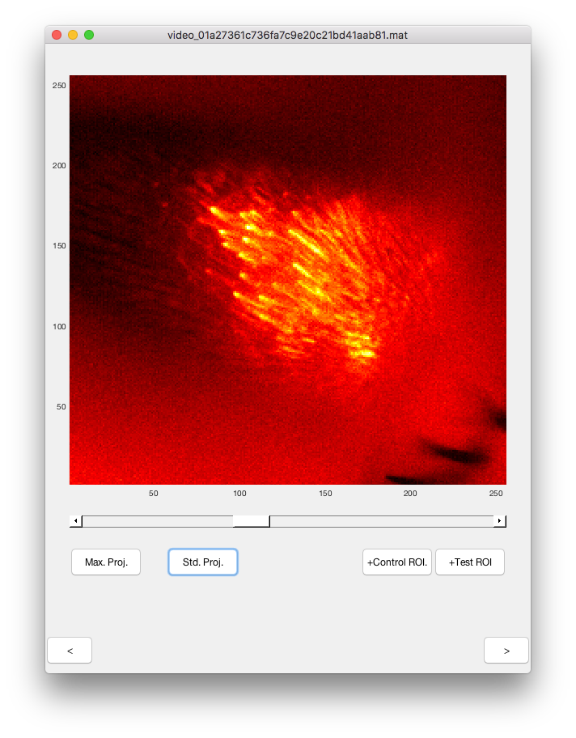

# markROI

Simple (<100 lines of code) UI to mark ROIs in image sequences written in MATLAB. This is built as a boilerplate for you to use in your own project.

## Features

* Lets your mark ROIs
* Works
* Fast. loading images is instantaneous, no matter how big the files are
* Automatically convert .mat files into HDF5 files for faster operations. 
* Intelligently figures out your data structure within a .mat file, no matter how many variables you have there. 

## Assumptions

* Your images are stored in a 3D matrix in a .mat file. 
* You want to mark some "control" ROIs and some "test" ROIs

## Hacking 

`markROI` is written as a single-file function, where different sub-functions make the UI, load and plot the image, etc. The parts you probably want to change to re-purpose this to your use are as follows:

### loadFile

a function that loads the file. markROI uses `matfile` to speed up loading files, and the handle to the .mat file is stored in a variable called `m`. Look at all reads and writes from `m` and change as needed if your .mat files are structured differently from what is listed in the assumptions. 

### makeUI

this function makes the UI. You might want to add or remove `uicontrol` elements from this. All handles to UI elements are stored in the `handles` structure. 

## License 

GPLv3